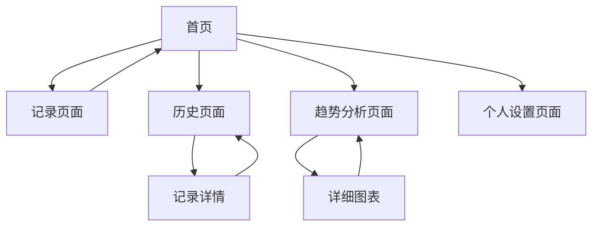

# 心流日记 - 产品需求文档

## 1. Product Overview

一款专注于情绪记录和心理疗愈的 Web 应用，帮助用户通过每日情绪记录、日记写作和多媒体记录来追踪和改善心理健康状态。

- 通过直观的数据可视化帮助用户了解情绪变化规律，提供个性化的情绪管理洞察。
- 目标用户为关注心理健康的个人用户，特别是需要情绪管理和自我疗愈的人群。

## 2. Core Features

### 2.1 User Roles

本应用采用单一用户角色设计，无需复杂的权限管理：

| Role | Registration Method  | Core Permissions                                           |
| ---- | -------------------- | ---------------------------------------------------------- |
| 用户 | 邮箱注册或第三方登录 | 记录情绪、写日记、上传媒体文件、查看历史记录、分析趋势数据 |

### 2.2 Feature Module

我们的心流日记包含以下主要页面：

1. **首页**：情绪快速记录、今日心情选择、快捷日记入口
2. **记录页面**：详细的情绪记录表单、日记编写、照片/录音上传
3. **历史页面**：日历视图、历史记录列表、搜索筛选功能
4. **趋势分析页面**：情绪折线图、词云可视化、情绪占比饼图
5. **个人设置页面**：用户信息管理、偏好设置、数据导出

### 2.3 Page Details

| Page Name    | Module Name | Feature description                                                          |
| ------------ | ----------- | ---------------------------------------------------------------------------- |
| 首页         | 快速记录区  | 显示当前日期，提供情绪快选按钮（开心、难过、焦虑、平静等），一键进入详细记录 |
| 首页         | 今日概览    | 展示今日已记录内容摘要，显示连续记录天数，激励用户坚持                       |
| 首页         | 导航菜单    | 提供到各功能页面的快捷入口，包含温馨的引导提示                               |
| 记录页面     | 情绪选择器  | 提供多种情绪选项的可视化选择界面，支持情绪强度调节                           |
| 记录页面     | 日记编辑器  | 富文本编辑功能，支持文字记录，提供写作提示和引导问题                         |
| 记录页面     | 媒体上传    | 支持照片上传和录音功能，提供预览和编辑选项                                   |
| 记录页面     | 保存提交    | 数据验证和保存，提供保存成功的温馨反馈                                       |
| 历史页面     | 日历视图    | 月历展示，标记有记录的日期，点击查看当日详情                                 |
| 历史页面     | 记录列表    | 时间线形式展示历史记录，支持分页和无限滚动                                   |
| 历史页面     | 搜索筛选    | 按日期范围、情绪类型、关键词搜索历史记录                                     |
| 趋势分析页面 | 情绪折线图  | 展示指定时间段内情绪变化趋势，支持时间范围选择                               |
| 趋势分析页面 | 词云组件    | 从日记内容提取高频词汇生成词云，词汇大小和颜色反映频率                       |
| 趋势分析页面 | 情绪饼图    | 统计各类情绪出现频次，以饼图形式直观展示情绪分布                             |
| 趋势分析页面 | 数据洞察    | 基于数据分析提供个性化的情绪管理建议和趋势解读                               |
| 个人设置页面 | 用户信息    | 头像上传、昵称修改、个人简介编辑                                             |
| 个人设置页面 | 偏好设置    | 情绪选项自定义、提醒设置、隐私选项配置                                       |
| 个人设置页面 | 数据管理    | 数据导出、备份恢复、账户注销选项                                             |

## 3. Core Process

**用户日常使用流程：**
用户进入首页后，可以快速选择当前心情并进入详细记录页面。在记录页面完成情绪选择、日记写作和媒体上传后保存记录。用户可以通过历史页面的日历或列表查看过往记录，也可以在趋势分析页面查看情绪数据的可视化分析。

## 4. User Interface Design

### 4.1 Design Style

- **主色调**：奶白色 (#FEFEFE)、雾紫色 (#E6E0F8)、淡蓝色 (#E8F4FD)
- **辅助色**：柔和粉色 (#F8E8F5)、淡绿色 (#E8F5E8)用于情绪状态区分
- **按钮样式**：圆角矩形设计，具有轻微阴影和渐变效果，营造果冻质感
- **字体**：优雅的无衬线字体，主标题 24px，正文 16px，辅助文字 14px
- **布局风格**：卡片式布局，大量留白，柔和的分割线和圆角设计
- **图标风格**：线性图标配合柔和填充，使用情绪相关的温馨图标和 emoji

### 4.2 Page Design Overview

| Page Name    | Module Name | UI Elements                                                |
| ------------ | ----------- | ---------------------------------------------------------- |
| 首页         | 快速记录区  | 大尺寸情绪按钮，渐变背景，柔和阴影效果，奶白色卡片容器     |
| 首页         | 今日概览    | 半透明雾紫色背景卡片，温馨的问候文字，连续天数的数字动效   |
| 记录页面     | 情绪选择器  | 圆形情绪按钮网格，选中状态有柔和光晕效果，配色区分不同情绪 |
| 记录页面     | 日记编辑器  | 简洁的文本框，淡蓝色边框，占位符文字引导，字数统计显示     |
| 记录页面     | 媒体上传    | 虚线边框的上传区域，拖拽交互，预览缩略图带圆角和阴影       |
| 历史页面     | 日历视图    | 柔和的月历设计，有记录的日期用彩色圆点标记，选中日期高亮   |
| 历史页面     | 记录列表    | 时间线布局，每条记录为独立卡片，情绪图标和文字预览         |
| 趋势分析页面 | 情绪折线图  | 柔和的曲线图表，渐变填充区域，淡色网格线，圆点标记数据点   |
| 趋势分析页面 | 词云组件    | 有机形状的词云布局，词汇颜色渐变，鼠标悬停有缩放动效       |
| 趋势分析页面 | 情绪饼图    | 柔和的饼图配色，扇形间有细微间隙，悬停时扇形轻微外扩       |

### 4.3 Responsiveness

应用采用移动优先的响应式设计，在手机端提供完整功能体验，平板和桌面端通过更大的布局空间提供更丰富的数据展示。所有交互元素都针对触摸操作进行了优化，包括合适的点击区域大小和手势支持。
