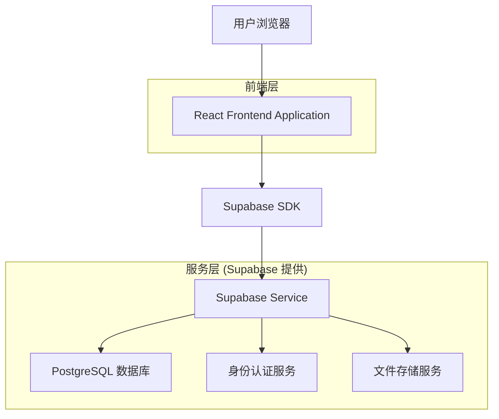
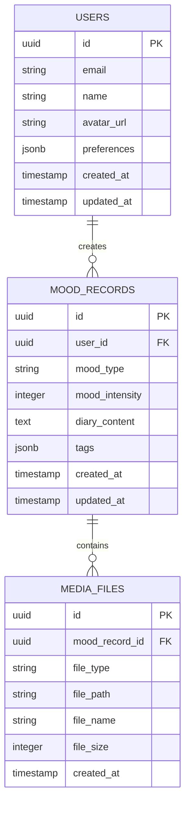

# 心流日记 - 技术架构文档

## 1. Architecture design



## 2. Technology Description

- Frontend: React@18 + TypeScript@5 + Vite@5 + TailwindCSS@3
- Backend: Supabase (提供数据库、认证、存储服务)
- 图表库: Recharts@2 (用于情绪趋势图表)
- 词云库: react-wordcloud@1 (用于词云可视化)
- 日期处理: date-fns@2
- 状态管理: Zustand@4
- 路由: React Router@6

## 3. Route definitions

| Route      | Purpose                                    |
| ---------- | ------------------------------------------ |
| /          | 首页，显示快速情绪记录和今日概览           |
| /record    | 详细记录页面，情绪选择、日记编写、媒体上传 |
| /history   | 历史记录页面，日历视图和记录列表           |
| /analytics | 趋势分析页面，情绪图表和数据洞察           |
| /settings  | 个人设置页面，用户信息和偏好配置           |
| /login     | 登录页面                                   |
| /register  | 注册页面                                   |

## 4. API definitions

### 4.1 Core API

由于使用 Supabase，主要通过 Supabase Client SDK 进行数据操作，以下为主要的数据操作接口：

**情绪记录相关**

```typescript
// 创建情绪记录
supabase.from('mood_records').insert({
  user_id: string,
  mood_type: string,
  mood_intensity: number,
  diary_content: string,
  created_at: string
});

// 获取用户情绪记录
supabase.from('mood_records').select('*').eq('user_id', userId).order('created_at', { ascending: false });
```

**媒体文件相关**

```typescript
// 上传文件到存储桶
supabase.storage.from('mood-media').upload(`${userId}/${fileName}`, file);

// 获取文件公共URL
supabase.storage.from('mood-media').getPublicUrl(filePath);
```

**数据分析相关**

```typescript
// 获取情绪趋势数据
supabase
  .from('mood_records')
  .select('mood_type, mood_intensity, created_at')
  .eq('user_id', userId)
  .gte('created_at', startDate)
  .lte('created_at', endDate);
```

## 5. Data model

### 5.1 Data model definition



### 5.2 Data Definition Language

**用户表 (users)**

```sql
-- 创建用户表
CREATE TABLE users (
    id UUID PRIMARY KEY DEFAULT gen_random_uuid(),
    email VARCHAR(255) UNIQUE NOT NULL,
    name VARCHAR(100) NOT NULL,
    avatar_url TEXT,
    preferences JSONB DEFAULT '{}',
    created_at TIMESTAMP WITH TIME ZONE DEFAULT NOW(),
    updated_at TIMESTAMP WITH TIME ZONE DEFAULT NOW()
);

-- 创建索引
CREATE INDEX idx_users_email ON users(email);

-- 设置权限
GRANT SELECT ON users TO anon;
GRANT ALL PRIVILEGES ON users TO authenticated;
```

**情绪记录表 (mood_records)**

```sql
-- 创建情绪记录表
CREATE TABLE mood_records (
    id UUID PRIMARY KEY DEFAULT gen_random_uuid(),
    user_id UUID NOT NULL,
    mood_type VARCHAR(50) NOT NULL CHECK (mood_type IN ('happy', 'sad', 'anxious', 'calm', 'excited', 'angry', 'peaceful', 'stressed')),
    mood_intensity INTEGER NOT NULL CHECK (mood_intensity >= 1 AND mood_intensity <= 10),
    diary_content TEXT,
    tags JSONB DEFAULT '[]',
    created_at TIMESTAMP WITH TIME ZONE DEFAULT NOW(),
    updated_at TIMESTAMP WITH TIME ZONE DEFAULT NOW()
);

-- 创建索引
CREATE INDEX idx_mood_records_user_id ON mood_records(user_id);
CREATE INDEX idx_mood_records_created_at ON mood_records(created_at DESC);
CREATE INDEX idx_mood_records_mood_type ON mood_records(mood_type);

-- 设置权限
GRANT SELECT ON mood_records TO anon;
GRANT ALL PRIVILEGES ON mood_records TO authenticated;
```

**媒体文件表 (media_files)**

```sql
-- 创建媒体文件表
CREATE TABLE media_files (
    id UUID PRIMARY KEY DEFAULT gen_random_uuid(),
    mood_record_id UUID NOT NULL,
    file_type VARCHAR(20) NOT NULL CHECK (file_type IN ('image', 'audio')),
    file_path TEXT NOT NULL,
    file_name VARCHAR(255) NOT NULL,
    file_size INTEGER,
    created_at TIMESTAMP WITH TIME ZONE DEFAULT NOW()
);

-- 创建索引
CREATE INDEX idx_media_files_mood_record_id ON media_files(mood_record_id);

-- 设置权限
GRANT SELECT ON media_files TO anon;
GRANT ALL PRIVILEGES ON media_files TO authenticated;
```

**初始化数据**

```sql
-- 插入示例情绪记录数据（用于首次体验）
INSERT INTO mood_records (user_id, mood_type, mood_intensity, diary_content, created_at) VALUES
('00000000-0000-0000-0000-000000000000', 'happy', 8, '今天天气很好，和朋友一起去公园散步，心情特别愉快。看到盛开的樱花，感觉生活充满了美好。', NOW() - INTERVAL '7 days'),
('00000000-0000-0000-0000-000000000000', 'calm', 6, '晚上读了一本好书，泡了一壶茶，感觉内心很平静。这种简单的快乐让我觉得很满足。', NOW() - INTERVAL '6 days'),
('00000000-0000-0000-0000-000000000000', 'anxious', 4, '明天要做重要的演讲，有点紧张。但是我已经准备得很充分了，相信自己能够做好。', NOW() - INTERVAL '5 days'),
('00000000-0000-0000-0000-000000000000', 'excited', 9, '收到了心仪公司的面试邀请！虽然还没有最终结果，但这已经是一个很好的开始了。', NOW() - INTERVAL '4 days'),
('00000000-0000-0000-0000-000000000000', 'peaceful', 7, '周末在家整理房间，听着轻音乐，感觉时间过得很慢很舒服。简单的生活也有它的美好。', NOW() - INTERVAL '3 days'),
('00000000-0000-0000-0000-000000000000', 'sad', 3, '今天想起了一些往事，有点难过。但是我知道这些情绪都会过去的，明天又是新的一天。', NOW() - INTERVAL '2 days'),
('00000000-0000-0000-0000-000000000000', 'happy', 8, '和家人一起吃晚饭，聊了很多有趣的话题。家人的陪伴总是让我感到温暖和幸福。', NOW() - INTERVAL '1 day');
```

**存储桶配置**

```sql
-- 创建媒体文件存储桶
INSERT INTO storage.buckets (id, name, public) VALUES ('mood-media', 'mood-media', true);

-- 设置存储桶策略
CREATE POLICY "用户可以上传自己的媒体文件" ON storage.objects
FOR INSERT WITH CHECK (auth.uid()::text = (storage.foldername(name))[1]);

CREATE POLICY "用户可以查看自己的媒体文件" ON storage.objects
FOR SELECT USING (auth.uid()::text = (storage.foldername(name))[1]);
```
